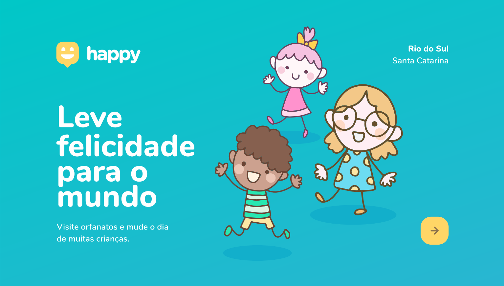
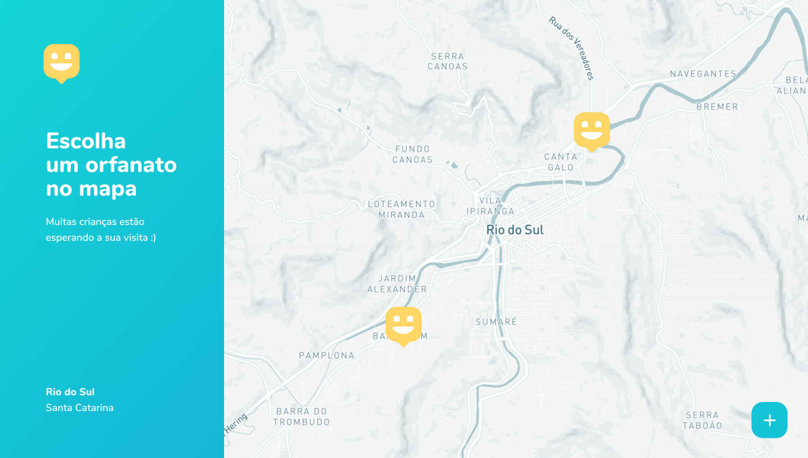
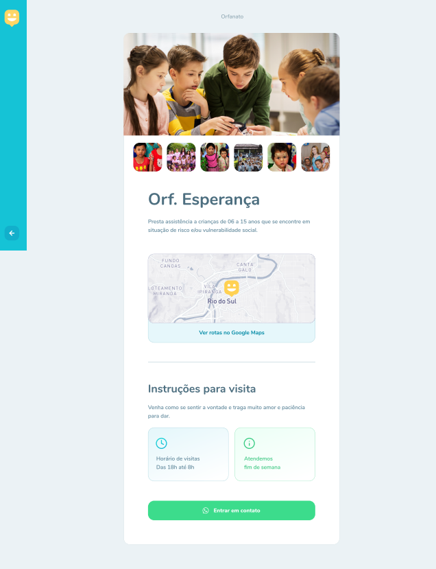

## Happy

<h1 align="center">
    
    <a href="#"> Happy </a>
</h1>

<h2 align="center">
    A website to help you find orphanages around you! Inspired by Next
            Level Week 3 🚀
</h2>

<h3 align="center"> 
	 Status: 🚀 Under construction... 🚧
</h3>

 <a href="#about">About</a> •
 <a href="#features">Features</a> •
 <a href="#layout">Layout</a> • 
 <a href="#tech-stack">Tech Stack</a> • 
 <a href="#user-content-license">License</a>

## About

😀 Happy - is a way to connect people and orphanages.
Project developed during **NLW - Next Level Week** offered by [Rocketseat](https://nextlevelweek.com/). NLW is an online experience with lots of practical content, challenges and hacks where the content is available for a week.

---

## Features

   - [x] Entities can register on the web platform by sending:
   - [x] images of the orphanage
   - [x] entity name, email and whatsapp
   - [x] and the address so that it can appear on the map
   - [x] instructions for visitation

   - [x] Users have access to the mobile application/website, where they can:
   - [x] browse the map to see the registered institutions
   - [x] contact the entity via E-mail or WhatsApp

---

## Layout

The application layout is available on Figma:

### Web

	 
  

  

---

## Tech Stack

The following tools were used in the construction of the project:

-   Prototype:  **[Figma](https://www.figma.com/)**  →  *[Protótipo (Happy)](https://www.figma.com/file/MkaYjG7YhtJDQH7LICoSTd/Happy-Web-(Copy))*
-   Maps:  **[Leaflet](https://react-leaflet.js.org/en/)**
-   Editor:  **[Visual Studio Code](https://code.visualstudio.com/)**  → Extensions:  **[TabNine](https://marketplace.visualstudio.com/items?itemName=TabNine.tabnine-vscode)** | **[Prettier](https://marketplace.visualstudio.com/items?itemName=esbenp.prettier-vscode)** | **[Live Server](https://marketplace.visualstudio.com/items?itemName=ritwickdey.LiveServer)**
-   Fonts:  **[Google Fonts](https://fonts.google.com/specimen/Nunito)**

---

## How to contribute

1. Fork the project.
2. Create a new branch with your changes: `git checkout -b my-feature`
3. Save your changes and create a commit message telling you what you did: `git commit -m" feature: My new feature "`
4. Submit your changes: `git push origin my-feature`

---

## License

This project is under the license [MIT](./LICENSE.md).

Made with love by Ana Laura 👋🏽 [Get in Touch!](Https://www.instagram.com/llaurabp/)

---
